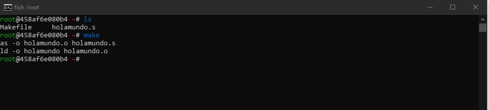

  

### Voy a mostrar la ejecución de un programa, en este caso holamundo.s, dentro de la imagen de Alpine Linux 64 bits
### holamundo.s: https://github.com/Luis-Alonso18/AlpineLinux/blob/main/code/holamundo.s
```s
.data

/* Segmento de Datos: define el mensaje y calcula el tramaño de la cadena. */
msg:
    .ascii        "Hello, ARM64!\n"
len = . - msg

.text

/* Cuerpo del programa para desplegar la variable anterior. */
.globl _start
_start:
    /* syscall write(int fd, const void *buf, size_t count) */
    mov     x0, #1      /* fd := STDOUT_FILENO */
    ldr     x1, =msg    /* buf := msg */
    ldr     x2, =len    /* count := len */
    mov     w8, #64     /* write is syscall #64 */
    svc     #0          /* invoke syscall */

    /* syscall exit(int status) */
    mov     x0, #0      /* status := 0 */
    mov     w8, #93     /* exit is syscall #1 */
    svc     #0          /* invoke syscall */
```  

### Iniciamos compilando el programa con ayuda del Makefile
### Makefile: https://github.com/Luis-Alonso18/AlpineLinux/blob/main/code/Makefile  
```makefile
#Makefile
all:
  as -o holamundo.o holamundo.s
  ld -o holamundo holamundo.o
  
clean:
  rm -vf holamundo *.o
  
clean:
  rm -vf holamundo *.o
```
  

### Ahora ejecutamos el programa
```bash
$ ./holamundo
```
  

### Utilizamos el GEF que es una versión mejorada del GDB, pero lamentablemente sale un error al querer correrlo
```bash
$ gdb holamundo
```  
  

### Una vez que terminamos de usar el programa, usamos el Makefile para borrar los archivos sobrantes (ejecutables y .o)  
```bash
$ make clean
```  
  
